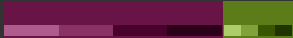

# Curriculum Vitae
As the first part of the final project of hypermedia, the objective was to make my own Curriculum Vitae with the knowledge of HTML and CSS acquired during this semester.

In this readme file there's the analytical part of the project as well as the possible design previously done using Figma.

## Project Analysis
### Final user characterisation
As my experience is scarce, having only been a babysitter and participated in two volunteer programs where I had to ensure the safety of different groups of people, I thougth that looking for a job more focused on taking care of children would be the most appropriate.

Then, once this is cleared up, the final user would be a busy mother who's looking for someone to look after her children while she's busy working.

Having my hard skills I would say one of the children is intrested in technology so the woman takes it into account.

### Information architecture
The information would be found on a single web page, structured in groups one below the other to display the information as clear and easy to find as possible.

### Visual Design
Once the structure of the page has been planned, inspired by different CV examples, the final design has been reached, which has been captured in Figma to have a reference when starting to program. [Figma design](https://www.figma.com/file/P3zopB2ASsWiNlhjfzulLU/CV)

The page would be divided into two columns, the one on the right would have the header at the beginning followed by the four most relevant sections of information, while 
the left column would start with a picture of me followed by the remaining sections (the last one being the "contact" section).

Thanks to Paletton, the color palette has been chosen from two complementary colors. 

A version of the first color has been used for the background of the headings and the dots of the lists while a lighter version of the second one has been used for the headings themselves and the background of the left column.

The typography was planned to be simple and thin with a little bit of serif so that its minimalism would beautify the page and make it easy to read. 
After investigating the font-families that CSS offers, the chosen one has been the following one: 'Segoe UI', Tahoma, Geneva, Verdana, sans-serif'.
